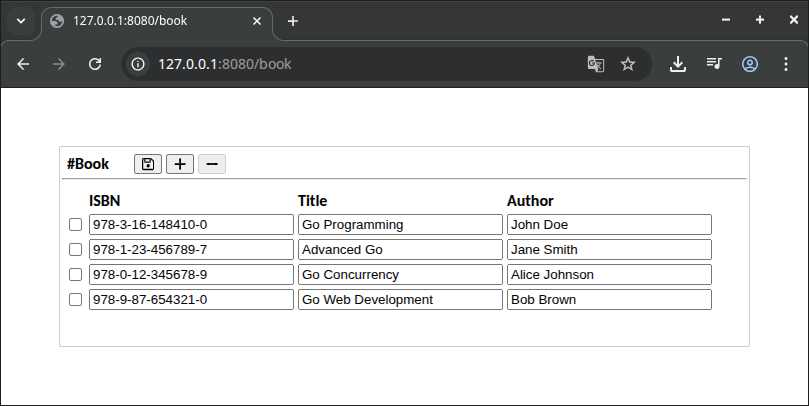

# Declarative Entity-Views

## Run

```sh
go install github.com/a-h/templ/cmd/templ@latest
go mod download
templ generate && go run .
```

## Demo

```golang
type Book struct {
	ISBN   string `gorm:"column:ISBN;primaryKey" label:"ISBN"`
	Title  string `gorm:"column:Title" label:"Title"`
	Author string `gorm:"column:Author" label:"Author"`
}

func main() {
	db := decl.Setup(Book{})

	fmt.Println("Listening on :8080")
	fmt.Println(http.ListenAndServe(":8080", nil))
}
```

